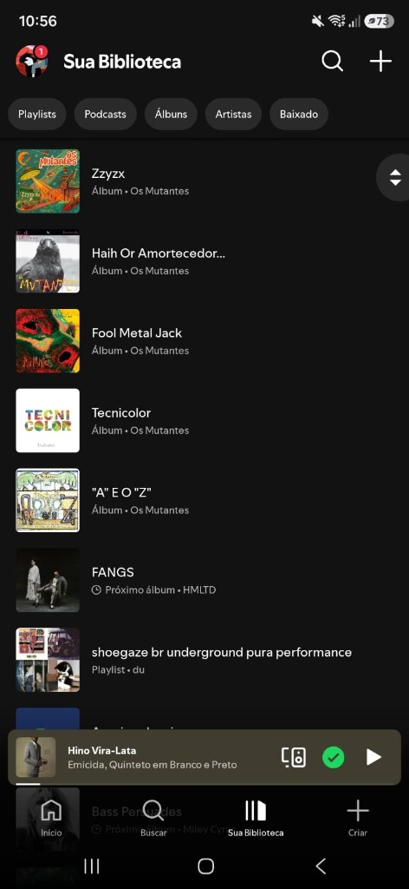
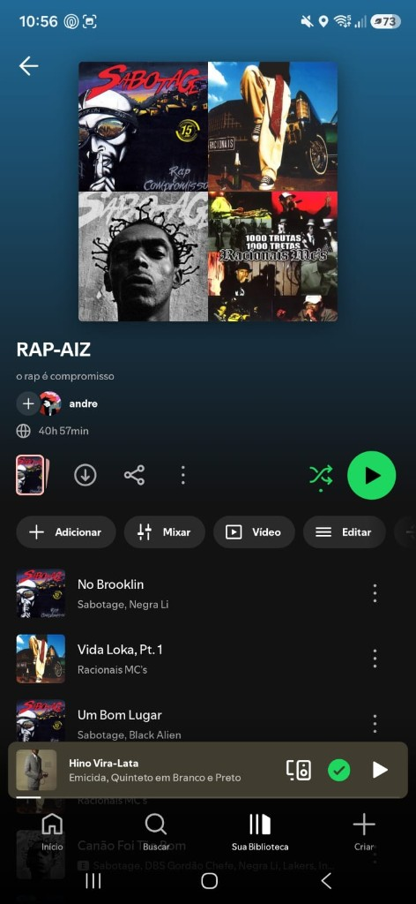
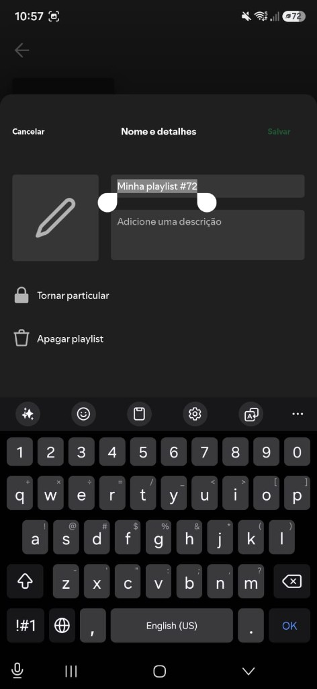

# Trabalho I — Clone Spotify (React Native + Expo)

Reprodução de três telas do **Spotify** com React Native, Expo Router e TypeScript, para a disciplina Desenvolvimento de Aplicativos.

## Aplicativo de referência

**Spotify** (mobile)

## Três telas escolhidas

1. **Sua Biblioteca** — listagem de playlists/álbuns com filtros (chips) e `FlatList`
2. **Detalhe da playlist** — capa, metadados e lista de faixas; recebe `id` por parâmetro de rota
3. **Criar playlist** — formulário modal (nome, descrição, particular) com estado controlado

Fluxo: Biblioteca → Detalhe (`/playlist/[id]`) → Criar (`/playlist/criar`)

## Como executar

```bash
npm install
npx expo start
```

Depois abra no Expo Go, emulador Android/iOS ou web. O app funciona **sem internet** (dados mockados locais; capas são placeholders coloridos).

## Screenshots de referência

| Tela           | Arquivo                                                |
| -------------- | ------------------------------------------------------ |
| Biblioteca     |     |
| Detalhe        |  |
| Criar playlist |      |

## Funcionalidades implementadas

- Navegação **Tabs + Stack** (Expo Router)
- Listagem com `FlatList`, `keyExtractor` e filtro por chips
- Passagem de parâmetro `id` da biblioteca para o detalhe
- Formulário com `TextInput`, `Switch` e feedback via `Alert`
- Mini player estático (visual)
- Tipagem TypeScript sem `any`
- Dados 100% locais

## Onde estão os dados mockados

- [`src/data/playlists.ts`](src/data/playlists.ts) — playlists/álbuns e “now playing”
- [`src/data/tracks.ts`](src/data/tracks.ts) — faixas
- [`src/types/spotify.ts`](src/types/spotify.ts) — interfaces

## Componentes reutilizáveis

Pasta [`src/components/spotify/`](src/components/spotify/):

| Componente                                           | Uso                            |
| ---------------------------------------------------- | ------------------------------ |
| `LibraryHeader`                                      | Cabeçalho da biblioteca        |
| `FilterChip`                                         | Chip de filtro                 |
| `LibraryItem`                                        | Item da listagem               |
| `CoverArt` / `CoverPickerPlaceholder`                | Capas locais                   |
| `PlaylistHeader`                                     | Cabeçalho do detalhe           |
| `PlaylistActions` / `QuickActionPill` / `ActionIcon` | Ações da playlist              |
| `TrackRow`                                           | Linha de faixa                 |
| `FormField`                                          | Campo de formulário            |
| `MiniPlayer`                                         | Barra de reprodução (estática) |

## Estrutura de pastas

```Markdown
src/
  app/
    _layout.tsx              # Stack raiz
    (tabs)/                  # Início, Buscar, Biblioteca
    playlist/[id].tsx        # Detalhe
    playlist/criar.tsx       # Formulário (modal)
  components/spotify/
  constants/spotify-theme.ts
  data/
  types/
```
